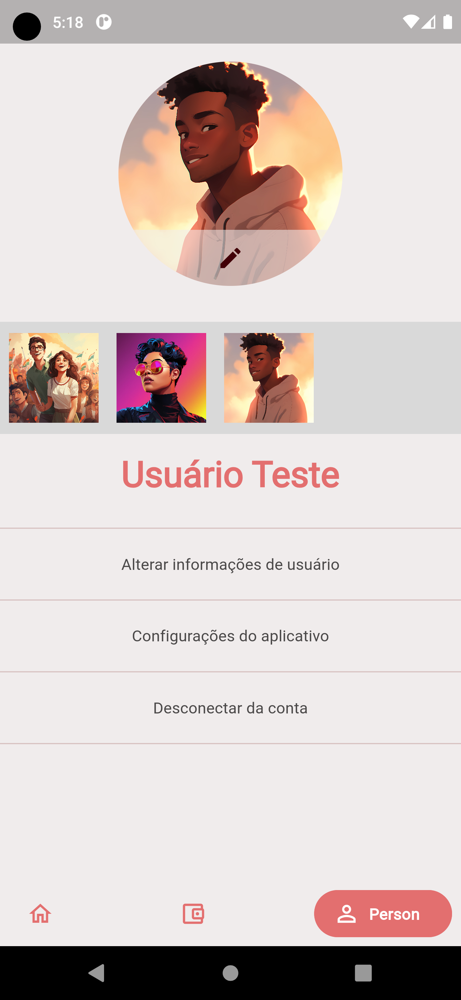
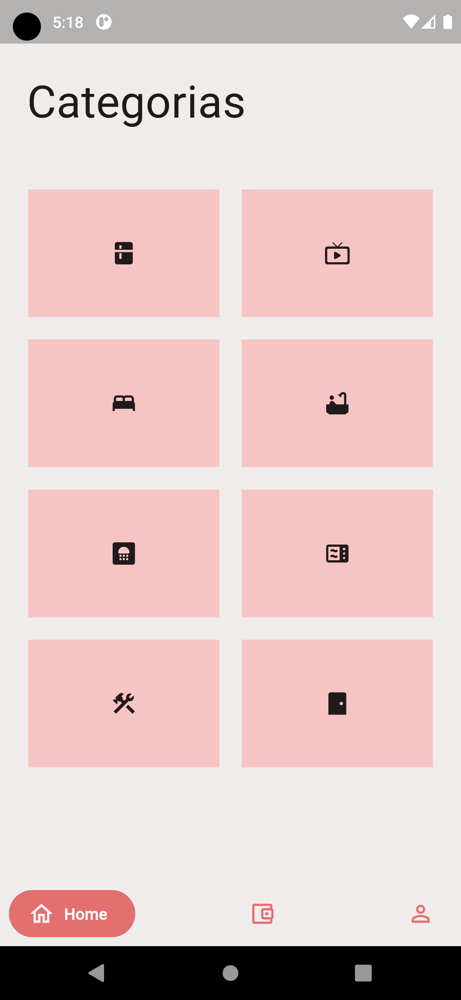
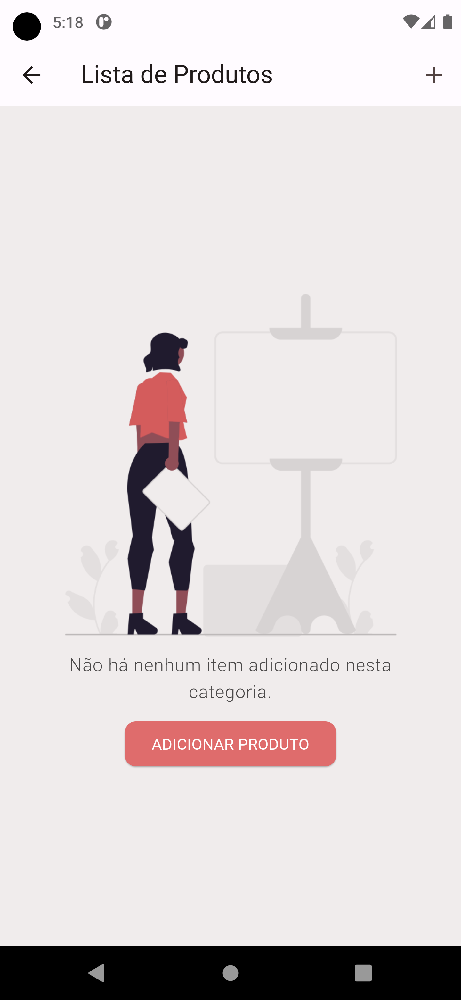

# EnxoList - Aplicativo para Enxoval.

Um simples aplicativo para poder armazenar sua lista de itens para comprar no seu enxoval da casa nova. Você pode armazenar por categorias os produtos que você deseja comprar para sua nova casa e ver o lado financeiro. 
O aplicativo ainda está em desenvolvimento, atualizarei conforme avança.

## Desenvolvimento

O aplicativo está sendo desenvolvido em Flutter e em Java Spring Boot (O backend está sendo feito por mim, atualizando conforme o projeto avança).
Repositório do backend: [SpringBoot - Enxolist.](https://github.com/lithoykai/springboot-Enxolist)

## Passos a serem feitos

 - [x] Autenticação para armazenar os dados em conta de usuário.
 - [x] Alteração de foto de perfil de usuário.
 - [x] Divisão por categoria dos produtos.
 - [x] Armazenamento offline dos dados.
 - [ ] Manipulação (CRUD) do produtos.
 - [ ] Manipulação (CRUD) offline dos produtos e sincronização quando estiver online. 
 - [ ] Avaliação financeira do quantitativo dos produtos.
 - [ ] Tema escuro.

## Alguns screenshots.

|| |||||

## 🔌 Packages 

| Name                                                                   | Usage                                         |
| ---------------------------------------------------------------------- | --------------------------------------------- |
| [**MobX**](https://pub.dev/packages/mobx)              | Gerenciamento de Estados                              |
| [**Hive**](https://pub.dev/packages/hive)                        | Persistência de dados offline |
| [**SharedPreferences**](https://pub.dev/packages/xml2json)                      | Persistências de pequenos dados.                           |
| [**DIO**](https://pub.dev/packages/dio)                                | Requisições HTTP               |
| [**GetIt** e **Injectable**](https://pub.dev/packages/get_it) | Injeção de Dependências         |
| [**JsonAnnotation**](https://pub.dev/packages/json_annotation) | Gerenciamento de dados.         |

## Meus projetos.

Alguns dos meus projetos anteriores.

| Projetos                                                                   | Github                                         |
| ---------------------------------------------------------------------- | --------------------------------------------- |
|[**WeekJobs**](https://github.com/lithoykai/orderService_Flutter)          |
|[**Finanças pessoais**](https://github.com/lithoykai/personal_expense)|            
|[**FoodRecipes**](https://github.com/lithoykai/food_recipes_app)          |
|[**Simple E-Commecer**](https://github.com/lithoykai/shop_app_Flutter)          |
|[**Lista de Contato**](https://github.com/lithoykai/contactList_app)          |
|[**ForwaderMessage**](https://github.com/lithoykai/TelegramForwarder-Python)          |

